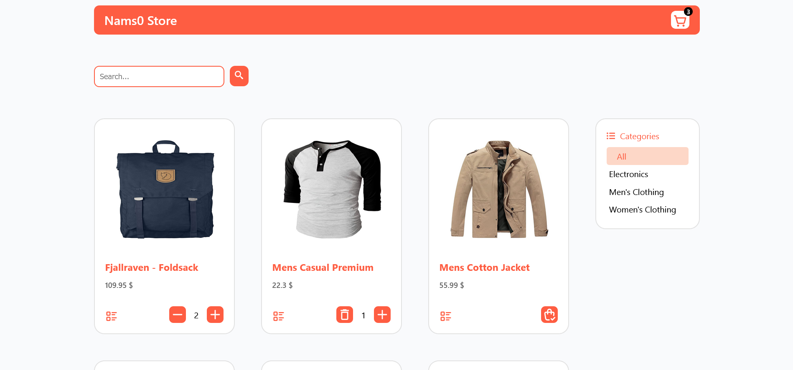
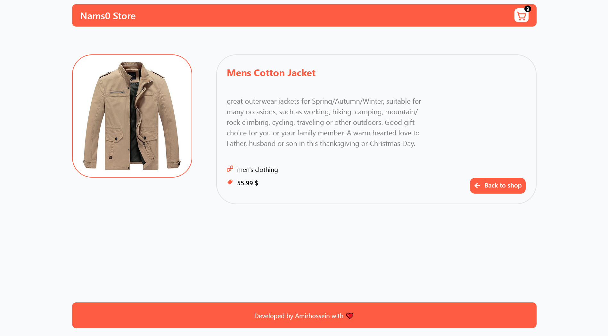
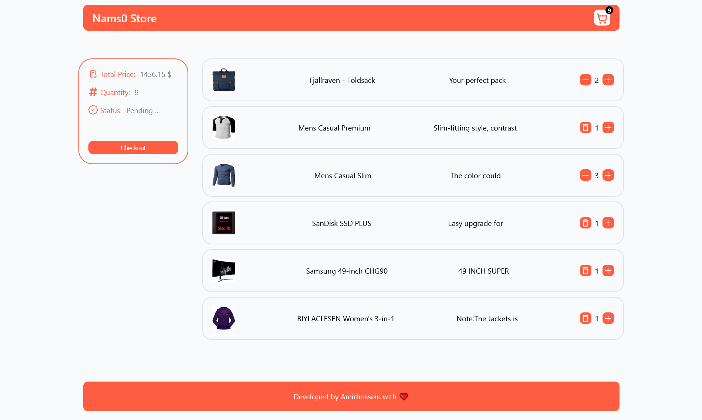
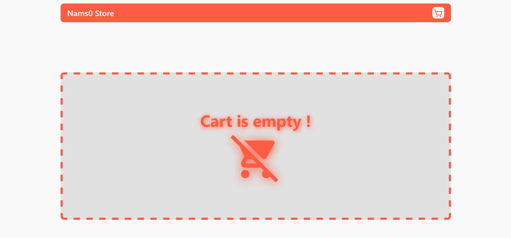

# 🛒 E-Commerce Store – Redux Edition (Single Page Application)

A modern, responsive **single-page e-commerce application (SPA)** built with **React**, using **Redux Toolkit** for global state management and **redux-persist** for seamless state persistence across sessions.

> 🔗 Based on [`nams0/web-store`](https://github.com/nams0/web-store) — restructured to use **Redux Toolkit** instead of Context API and `localStorage` directly.

---

## 🚀 Project Overview

This Redux-powered React SPA simulates a complete online shopping experience. It features a dynamic product catalog, responsive design, state-persistent cart system, and a streamlined user interface.

---

## ✨ Features

### 🛍 Product Catalog

- Browse products
- Filter by category
- Search by name
- View detailed product pages

### 🛒 Shopping Cart

- Add, remove, and update items
- Cart persists via `redux-persist` and `localStorage`
- Streamlined checkout experience

### 💡 UI & Experience

- Fully responsive and mobile-friendly
- Routing handled by **React Router**
- Loader indicators and empty cart messaging with animation

---

## 🧰 Tech Stack

- ⚛️ **React** with Hooks
- 🧭 **React Router** – SPA navigation
- 🛠 **Redux Toolkit** – State management
- 💾 **redux-persist** – State persistence via `localStorage`
- 📡 **Axios** – API communication
- 🎨 **CSS Modules** – Scoped component styling
- 🎧 **React Icons** – Icon integration

---

## 📁 Project Structure

```
src/
├── app/            # Redux store configuration and setup
├── components/     # Reusable UI components
├── constants/      # Static values and app-wide constants
├── features/       # Redux slices for cart, products, etc.
├── helpers/        # Utility functions and helper methods
├── layout/         # Layout components (Header, Footer)
├── pages/          # Page components (Product, Cart, Checkout, etc.)
├── services/       # API config and data fetching
├── App.jsx         # Root component with layout and routing
├── global.css      # Global stylesheet
└── main.jsx        # Application entry point
```

---

## 🔌 API Integration

This app consumes product data from the [Fake Store API](https://fakestoreapi.com). API configs and requests are handled in the `services/` folder.

---

## 💾 Redux State Persistence

Cart and app state are stored in `localStorage` using `redux-persist`. This ensures data remains even after page refreshes or browser restarts.

---

## 🧭 Redux Flow Overview

```mermaid
graph TD
    A[UI Components] -->|Dispatch| B[Redux Actions]
    B --> C[Redux Slices (Reducers)]
    C --> D[Redux Store]
    D -->|Persist| E[(localStorage via redux-persist)]
    D -->|Hydrate| A
    C -->|Selectors| A
```

---

## 📸 Screenshots

### 🏠 Home Page



### 🧾 Product Detail



### 🛒 Cart View



### 🗑️ Empty Cart


